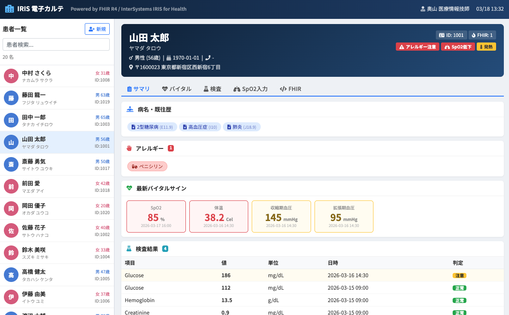

# IRIS for Health FHIR R4 デモ環境

InterSystems IRIS for Health 2025.3 による FHIR R4 デモ環境。
Docker Compose で起動するだけで、FHIR リポジトリ・電子カルテ UI・Interoperability プロダクションが一式動作する。

元テンプレート: [Intersystems-jp/IRIS-FHIR-Oximeter-Template](https://github.com/Intersystems-jp/IRIS-FHIR-Oximeter-Template)

---

## このデモでできること

- **FHIR R4 リポジトリ** — POST するだけで SQL テーブルが自動生成される JsonAdvSQL を体験
- **電子カルテ UI** — FHIR API だけで動く患者サマリ画面（バイタル・病名・アレルギー・検査結果）
- **Interoperability 連携** — SpO2 低下を検知して HL7 v2.5 メッセージを自動生成するフロー
- **マルチモデルアクセス** — 同じデータに FHIR REST / SQL / ObjectScript / グローバル変数でアクセス

---

## 構成

| コンテナ | ホスト名 | ポート | 説明 |
|---------|---------|--------|------|
| iris4h | iris | 11201:1972 (SuperServer) | IRIS for Health 2025.3 |
| webgw4h | webgw | 11202:80, 11203:443 | Web Gateway 2025.3 |

## セットアップ

**前提条件:**
- Docker Desktop
- `dockerfiles/iris/iris.key` に IRIS ライセンスキーを配置（評価ライセンスの発行は [InterSystems](https://www.intersystems.com/jp/) までお問い合わせください）
- 必要に応じて `docker-compose.yml` のポートフォワード設定（`11201`〜`11203`）を環境に合わせて変更

```bash
# ビルド・起動
docker compose up -d --build

# デモデータ投入（起動完了後）
bash demo/01_load_patients.sh
```

| 画面 | URL |
|------|-----|
| 電子カルテ UI | http://localhost:11202/csp/emr/index.html |
| FHIR R4 エンドポイント | http://localhost:11202/csp/healthshare/fhirserver/fhir/r4 |
| Management Portal | http://localhost:11202/csp/sys/%25CSP.Portal.Home.zen |

認証情報: `_SYSTEM` / `SYS`

---

## デモシナリオ

### シナリオ1: FHIR R4 → SQL 自動マッピング

FHIR リソースを POST するだけで、ETL なしに SQL テーブルが自動生成される。これが JsonAdvSQL（2024.1〜）の核心機能。

```sql
-- 患者一覧（POST しただけで SQL で引ける）
SELECT Key, BirthDate, Gender FROM HSFHIR_X0001_S.Patient

-- SpO2 < 90% の患者を抽出（臨床アラート相当）
SELECT o.subject_Reference, vq.value_ValueLowRaw AS "SpO2(%)"
FROM HSFHIR_X0001_S_Observation.valueQuantity vq
JOIN HSFHIR_X0001_S.Observation o ON o.Key = vq.Key
JOIN HSFHIR_X0001_S_Observation.code oc ON oc.Key = o.Key
WHERE oc.value_Value = '2708-6' AND CAST(vq.value_ValueLowRaw AS NUMERIC) < 90
```

実務的な SQL クエリ集（22本・8業務シチュエーション対応）: `demo/05_practical_sql_queries.sql`

### シナリオ2: マルチモデルアクセス

同じデータに FHIR API / SQL / ObjectScript / グローバル変数の 4 つの方法で同時アクセスできる。IRIS のマルチモデルエンジンならではの特徴。

```bash
docker exec -it iris4h iris session IRIS -U FHIRSERVER
```

実行例は `demo/03_objectscript_queries.txt` を参照。

### シナリオ3: パルスオキシメーター → HL7 自動変換

SpO2 < 90% のデータが送信されると、Interoperability プロダクションが自動で HL7 v2.5 SIU_S12 メッセージを生成する。BPL（ビジネスロジック）も DTL（データ変換）も GUI で定義されており、コードを書く必要がない。

```bash
bash demo/04_oximeter_test.sh
```

**処理フロー:**
```
FHIR Bundle POST
  → HS.FHIRServer.Interop.Service
    → Solution.FHIRBPL（SpO2 < 90% を判定）
      → Solution.FromFhirObsToSIUS12（DTL: HL7変換）
        → EnsLib.HL7.Operation.FileOperation（./Out/ にHL7ファイル出力）
```

ビジュアルトレースで処理フローを可視化:
`http://localhost:11202/csp/healthshare/fhirserver/EnsPortal.MessageViewer.zen`

---

## 主要コンポーネント

### Setup.cls — 環境構築の自動化

Docker イメージビルド時に FHIR サーバー・プロダクションを自動セットアップする初期化クラス。

1. **FHIRSERVER ネームスペース作成** — Interoperability 対応ネームスペースを構築
2. **ソースのインポート** — BPL・DTL・プロダクション定義をコンパイル
3. **FHIR R4 サーバー構築** — JsonAdvSQL ストレージ戦略で FHIR エンドポイントを作成
4. **Interop 連携** — FHIR リクエストが Interoperability Service を経由するよう設定
5. **電子カルテ UI 登録** — `/csp/emr` を CSP アプリケーションとして登録
6. **プロダクション開始** — `Solution.FoundationProduction` を自動起動

### FHIRBPL.cls — ビジネスプロセス

FHIR リクエストを受け取り、SpO2 値を評価するビジネスプロセス（BPL）。

- FHIR CRUD を `HS.FHIRServer.Interop.Operation` に委譲
- Bundle 内の Observation から SpO2 を抽出
- SpO2 < 90% の場合、DTL 変換を呼び出して HL7 メッセージを生成

### FromFhirObsToSIUS12.cls — データ変換

BPL のコンテキスト（SpO2値・患者名・患者ID）から HL7 v2.5 SIU_S12 メッセージを組み立てるデータ変換（DTL）。

### 電子カルテ UI

FHIR R4 API を直接呼び出す電子カルテ風 UI。単体 HTML で動作し、外部依存は CDN のみ。



**主な機能:**
- 患者一覧（20名、検索フィルタ付き）
- 患者サマリ表示（病名・アレルギー・バイタル・検査結果）
- 異常値のハイライト（SpO2 < 90%, 体温 >= 38.0℃, HbA1c >= 7.0% 等）
- アラートバッジ（SpO2低下、発熱、高血圧、アレルギー注意）
- SpO2 入力 → Bundle POST（Interop 連携で HL7 出力をトリガー可能）
- FHIR JSON 生データ表示

### デモデータ

`demo/01_load_patients.sh` で投入される臨床的に整合性のあるダミーデータ:

| リソース | 件数 | 内容 |
|---------|------|------|
| Patient | 20名 | 全国各地の日本人（20代〜80代、男女各10名） |
| Observation (SpO2) | 19件 | 正常値(97%)〜重症(78%) |
| Observation (体温) | 19件 | 平熱(36.3℃)〜高熱(39.1℃) |
| Observation (血圧) | 13件 | 正常(118/75)〜重症高血圧(170/110) |
| Observation (検査) | 20件 | 血糖値・HbA1c・ヘモグロビン・クレアチニン |
| Condition | 23件 | 糖尿病・高血圧・CKD・心不全・COPD・喘息・肺炎・睡眠時無呼吸 |
| AllergyIntolerance | 10件 | 薬剤（ペニシリン等）・食物（そば等）・環境（花粉等） |

### SQL クエリ集

`demo/05_practical_sql_queries.sql` — 8つの業務シチュエーションに対応した22本のクエリ:

| # | シチュエーション | 例 |
|---|-----------------|-----|
| 1 | 外来受付 — 患者検索 | 姓で検索、診察券番号で特定、住所で抽出 |
| 2 | 診察室 — 患者の全体像把握 | 病名一覧、アレルギー、バイタル履歴、検査結果 |
| 3 | 病棟 — 異常値アラート | SpO2 < 90% 抽出、発熱患者、感染症疑い |
| 4 | 処方チェック — アレルギー確認 | ペニシリン系アレルギー、薬剤/食物アレルギー一覧 |
| 5 | 慢性疾患管理 — 糖尿病外来 | HbA1c一覧、治療強化対象、糖尿病性腎症の早期発見 |
| 6 | 腎臓内科 — CKD管理 | CKDステージ一覧、Cr/Hbの相関（腎性貧血の評価） |
| 7 | 経営・レポート — 統計 | 疾患別患者数、検査実施件数、併存疾患数 |
| 8 | 多職種連携 — 横断検索 | 重症患者の病名+アレルギー横断ビュー |

---

## 技術詳細

### JsonAdvSQL ストレージ戦略

IRIS for Health 2024.1 で導入された FHIR ストレージ戦略。2024.1 以降のデフォルトであり、従来の `HS.FHIRServer.Storage.Json` を置き換える。

**特徴:**
- **FHIR → SQL 自動マッピング** — POST するだけで検索パラメータに基づく SQL テーブルが自動生成される
- **マルチモデルアクセス** — FHIR REST / SQL / ObjectScript / グローバル変数の 4 方式で同時アクセス
- **検索性能** — コンパートメント検索、`_include`/`_revinclude`（`:iterate`対応）、拡張プレフィックス（`sa`, `eb`, `ap`）をフルサポート
- **BI/分析ツール連携** — JDBC/ODBC 経由で Tableau、Power BI 等から直接クエリ可能

#### 従来ストレージとの比較

| 項目 | Json（レガシー） | JsonAdvSQL（推奨） |
|------|-----------------|-------------------|
| 導入バージョン | 2024.1 より前 | **2024.1 以降（デフォルト）** |
| SQL テーブル生成 | なし | **自動生成** |
| コンパートメント検索 | 制限あり | **フルサポート** |
| `_include` / `_revinclude` | 制限あり | **フルサポート**（`:iterate` 対応） |
| 検索プレフィックス | 基本のみ | **`sa`, `eb`, `ap` 対応** |
| パフォーマンス | 標準 | **大幅に改善** |

#### テーブル構造

```
HSFHIR_X0001_S.Patient                        ← メインテーブル（1患者=1行）
HSFHIR_X0001_S_Patient.family                 ← 姓の検索用サブテーブル
HSFHIR_X0001_S_Patient.address                ← 住所の検索用サブテーブル
HSFHIR_X0001_S_Patient.identifier             ← 識別子のサブテーブル
HSFHIR_X0001_S.Observation                    ← Observationメインテーブル
HSFHIR_X0001_S_Observation.valueQuantity      ← 測定値のサブテーブル
HSFHIR_X0001_S_Observation.code               ← LOINCコードのサブテーブル
HSFHIR_X0001_S.Condition                      ← 病名メインテーブル
HSFHIR_X0001_S_Condition.code                 ← ICD-10コードのサブテーブル
HSFHIR_X0001_S.AllergyIntolerance             ← アレルギーメインテーブル
HSFHIR_X0001_S_AllergyIntolerance.code        ← アレルゲンのサブテーブル
```

- `X0001` — FHIR サーバーインスタンスの番号（複数エンドポイント作成時に増加）
- `S` — Search テーブル（検索パラメータベースのインデックス）
- メインテーブルには共通の検索パラメータ（`_id`, `_lastUpdated`, `subject` 等）が格納
- サブテーブルにはリソース固有の検索パラメータ（`family`, `address`, `valueQuantity` 等）が展開

### Interoperability プロダクション構成

```
HS.FHIRServer.Interop.Service（ビジネスサービス）
  → Solution.FHIRBPL（ビジネスプロセス: SpO2判定）
    → HS.FHIRServer.Interop.Operation（FHIR CRUD実行）
    → Solution.FromFhirObsToSIUS12（DTL: HL7変換）
      → To_Scheduling / EnsLib.HL7.Operation.FileOperation（HL7ファイル出力）
```

---

## ファイル構成

```
iris4h-demo/
├── docker-compose.yml           # Docker Compose 定義
├── readme.md                    # このファイル
│
├── dockerfiles/
│   ├── iris/
│   │   ├── dockerfile           # IRIS for Health イメージ定義
│   │   ├── iris.script          # IRIS 初期化スクリプト
│   │   ├── Setup.cls            # FHIRサーバー・プロダクションのセットアップクラス
│   │   └── iris.key             # ライセンスキー（※git管理外）
│   └── webgw/
│       ├── dockerfile           # Web Gateway イメージ定義
│       └── opt/iris/
│           ├── CSP.conf         # Apache CSP モジュール設定
│           └── CSP.ini          # Web Gateway 接続設定
│
├── src/
│   ├── emr/
│   │   └── index.html           # 電子カルテ UI（FHIR fetch API ベース）
│   └── Solution/
│       ├── FHIRBPL.cls          # ビジネスプロセス（BPL: SpO2チェック）
│       ├── FoundationProduction.cls  # プロダクション定義
│       └── FromFhirObsToSIUS12.cls   # データ変換（DTL: FHIR→HL7 SIU_S12）
│
├── demo/
│   ├── 00_agenda.md             # デモ Agenda
│   ├── 01_load_patients.sh      # デモデータ投入（患者20名+臨床データ）
│   ├── 02_sql_queries.sql       # 基本 SQL クエリ集
│   ├── 03_objectscript_queries.txt  # ObjectScript クエリ集
│   ├── 04_oximeter_test.sh      # パルスオキシメーター デモスクリプト
│   └── 05_practical_sql_queries.sql # 実務 SQL クエリ集（22本）
│
├── SampleResource/              # サンプル FHIR リソース（JSON）
│   ├── test_Patient.json
│   └── test_Bundle_Patient_Observation.json
│
└── Out/                         # HL7 メッセージ出力先（実行時に生成）
    └── .gitkeep
```

---

## 参考リンク

### InterSystems 公式ドキュメント

- [FHIR Server: An Introduction](https://docs.intersystems.com/irisforhealthlatest/csp/docbook/DocBook.UI.Page.cls?KEY=HXFHIROVW_server_intro) — FHIR サーバーのアーキテクチャと JsonAdvSQL の概要
- [Installing a New FHIR Server](https://docs.intersystems.com/irisforhealthlatest/csp/docbook/DocBook.UI.Page.cls?KEY=HXFHIRINS_server_install_new) — FHIR サーバーのインストール手順
- [Customizing a FHIR Server](https://docs.intersystems.com/irisforhealthlatest/csp/docbook/DocBook.UI.Page.cls?KEY=HXFHIRADM_server_customize_arch) — FHIR サーバーのカスタマイズ
- [FHIR SQL Builder](https://docs.intersystems.com/irisforhealthlatest/csp/docbook/DocBook.UI.Page.cls?KEY=HXFHIRFSB_intro) — FHIR SQL Builder の概要

### クラスリファレンス

- [HS.FHIRServer.Storage.JsonAdvSQL.Interactions](https://docs.intersystems.com/irisforhealthlatest/csp/documatic/%25CSP.Documatic.cls?LIBRARY=HSSYS&CLASSNAME=HS.FHIRServer.Storage.JsonAdvSQL.Interactions)
- [HS.FHIRServer.Storage.JsonAdvSQL.SearchTable](https://docs.intersystems.com/irisforhealthlatest/csp/documatic/%25CSP.Documatic.cls?LIBRARY=HSLIB&CLASSNAME=HS.FHIRServer.Storage.JsonAdvSQL.SearchTable)

### リリースノート

- [New in IRIS for Health 2024.1](https://docs.intersystems.com/irisforhealthlatest/csp/docbook/DocBook.UI.Page.cls?KEY=HXIHRN_new20241) — JsonAdvSQL の導入
- [New in IRIS for Health 2024.3](https://docs.intersystems.com/irisforhealthlatest/csp/docbook/DocBook.UI.Page.cls?KEY=HXIHRN_new20243) — JsonAdvSQL の検索パフォーマンス改善

### 関連ドキュメント

- [エンジニアのための IRIS for Health ガイド](docs/why-iris-for-health.md) — 「自分で作らなくていいもの」一覧
- [電子カルテ UI アーキテクチャ（スライド用）](docs/emr-architecture-slides.md) — FHIR API だけで動く電子カルテのデータフロー・技術スタック
- [IRIS for Health がサポートする医療標準規格](docs/iris-healthcare-standards.md) — HL7 v2/FHIR/CDA/DICOM/IHE 等の対応一覧
- [症例検索アーキテクチャ（Embedding + Vector Search）](docs/case-search-architecture.md) — 自然言語による類似症例検索の設計
- [FHIR R4 仕様](https://hl7.org/fhir/R4/)
- [元テンプレート: IRIS-FHIR-Oximeter-Template](https://github.com/Intersystems-jp/IRIS-FHIR-Oximeter-Template)
- [iris-fhir-portal（UI アセット元）](https://github.com/diashenrique/iris-fhir-portal)
